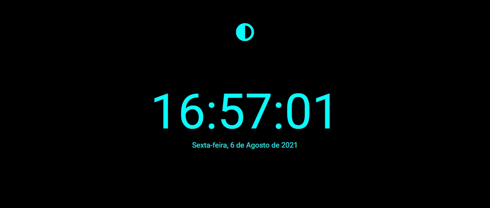

<h1 align = "center">
  Relógio Digital com JS
</h1>
 

  Projeto minimalista, desenvolvido para a prática de HTML5, CSS3 e JavaScript :v:

<h3 align="center">
  Deploy da Aplicação com Replit:
  <a href="https://relogio-digital.diegolramos.repl.co" target="__blank">ACESSE AQUI 

</h3>

<h4 align="center">
  Status: Finalizado :white_check_mark:
</h4>

  

  Feito com :heart:

